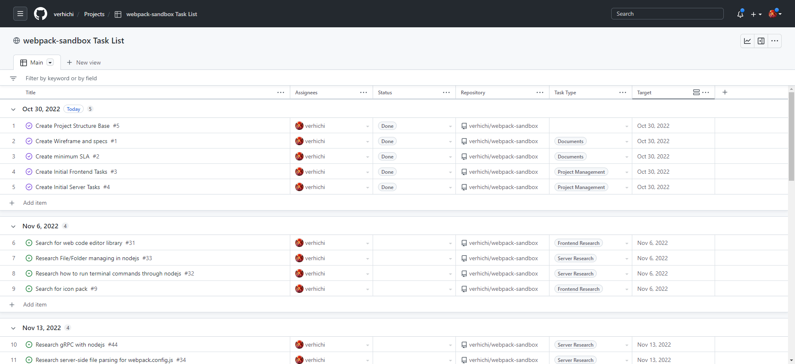

<!-- Original template at: https://github.com/othneildrew/Best-README-Template -->

<a name="readme-top"></a>

<!-- PROJECT SHIELDS -->
<!--
*** I'm using markdown "reference style" links for readability.
*** Reference links are enclosed in brackets [ ] instead of parentheses ( ).
*** See the bottom of this document for the declaration of the reference variables
*** for contributors-url, forks-url, etc. This is an optional, concise syntax you may use.
*** https://www.markdownguide.org/basic-syntax/#reference-style-links
-->

[![Contributors][contributors-shield]][contributors-url]
[![Forks][forks-shield]][forks-url]
[![Stargazers][stars-shield]][stars-url]
[![Issues][issues-shield]][issues-url]
[![MIT License][license-shield]][license-url]
[![LinkedIn][linkedin-shield]][linkedin-url]

<!-- PROJECT LOGO -->
<br />
<div align="center">
  <a href="https://github.com/verhichi/webpack-sandbox">
    <!-- TODO: Replace Logo -->
    
  </a>

<h3 align="center">Webpack Sandbox</h3>

  <p align="center">
    Play around with webpack settings to learn more about webpack!
    <br />
    <a href="https://github.com/verhichi/webpack-sandbox"><strong>Explore the docs »</strong></a>
  </p>
</div>

<!-- TABLE OF CONTENTS -->
<details>
  <summary>Table of Contents</summary>
  <ol>
    <li>
      <a href="#about-the-project">About The Project</a>
      <ul>
        <li><a href="#built-with">Built With</a></li>
      </ul>
    </li>
    <li>
      <a href="#getting-started">Getting Started</a>
    </li>
    <li><a href="#usage">Usage</a></li>
    <li><a href="#roadmap">Roadmap</a></li>
    <li><a href="#contributing">Contributing</a></li>
    <li><a href="#license">License</a></li>
    <li><a href="#contact">Contact</a></li>
    <li><a href="#acknowledgments">Acknowledgments</a></li>
  </ol>
</details>

<!-- ABOUT THE PROJECT -->

## About The Project

<!-- TODO: Replace Screenshot -->

[![Product Name Screen Shot][product-screenshot]](https://github.com/verhichi/webpack-sandbox)

Webpack has been an essential part of frontend development for years now. Though essential, its configuration still to this day confuses many engineers, especially with all the different types of third party libraries and frameworks that obfuscates all the settings within its own webpack configuration files.

This sandbox application aims to allow users to play around with webpack while learning what each webpack setting means and how it affects the output.

<p align="right">(<a href="#readme-top">back to top</a>)</p>

### Built With

- Front
  - [![React][react.js]][react-url]
  - [![Vite][vite.js]][vite-url]
  - [![Styleint][stylelint]][stylelint-url]
- Server
  - [![NestJS][nest.js]][nest-url]
- Common
  - [![TypeScript][typescript]][typescript-url]
  - [![Webpack][webpack]][webpack-url]
  - [![ESLint][eslint]][eslint-url]
  - [![Prettier][prettier]][prettier-url]

<p align="right">(<a href="#readme-top">back to top</a>)</p>

### Built For

This app will only be tested in the environment listed below:

- OS: [![Windows][windows]][windows-url]
- Browser: [![chrome][chrome]][chrome-url]
- Device: PC only(1920x1080)

<p align="right">(<a href="#readme-top">back to top</a>)</p>

<!-- GETTING STARTED -->

## Getting Started

Follow these steps to start the application locally.

1. Install dependencies

```bash
$ npm ci
```

2. Start up dev server

```bash
# this will start up the backend server on watch-mode at http://localhost:8080
$ npm start:server
```

```bash
# this will start up the frontend dev server at http://localhost:3000
$ npm start:front
```

3. Open `http://localhost:3000` on browser

<p align="right">(<a href="#readme-top">back to top</a>)</p>

<!-- USAGE EXAMPLES -->

## Usage

Use this app to learn more about webpack.

<p align="right">(<a href="#readme-top">back to top</a>)</p>

<!-- ROADMAP -->

## Roadmap

- I am managing my roadmap and tasks with Github Project(feel free to check it out): https://github.com/users/verhichi/projects/2/views/1

I listed out all the tasks I think I needed and then grouped them by target date



<p align="right">(<a href="#readme-top">back to top</a>)</p>

<!-- CONTRIBUTING -->

## Contributing

Contributions are what make the open source community such an amazing place to learn, inspire, and create. Any contributions you make are **greatly appreciated**.

If you have a suggestion that would make this better, please fork the repo and create a pull request. You can also simply open an issue with the tag "enhancement".
Don't forget to give the project a star! Thanks again!

1. Fork the Project
2. Create your Feature Branch (`git checkout -b feature/AmazingFeature`)
3. Commit your Changes (`git commit -m 'Add some AmazingFeature'`)
4. Push to the Branch (`git push origin feature/AmazingFeature`)
5. Open a Pull Request

<p align="right">(<a href="#readme-top">back to top</a>)</p>

<!-- LICENSE -->

## License

Distributed under the MIT License. See `LICENSE.txt` for more information.

<p align="right">(<a href="#readme-top">back to top</a>)</p>

<!-- CONTACT -->

## Contact

Project Link: [https://github.com/verhichi/webpack-sandbox](https://github.com/verhichi/webpack-sandbox)

<p align="right">(<a href="#readme-top">back to top</a>)</p>

<!-- ACKNOWLEDGMENTS -->

## Acknowledgments

- [The awesome README.md template that I used](https://github.com/othneildrew/Best-README-Template)

<p align="right">(<a href="#readme-top">back to top</a>)</p>

<!-- MARKDOWN LINKS & IMAGES -->
<!-- https://www.markdownguide.org/basic-syntax/#reference-style-links -->

[contributors-shield]: https://img.shields.io/github/contributors/verhichi/webpack-sandbox.svg?style=for-the-badge
[contributors-url]: https://github.com/verhichi/webpack-sandbox/graphs/contributors
[forks-shield]: https://img.shields.io/github/forks/verhichi/webpack-sandbox.svg?style=for-the-badge
[forks-url]: https://github.com/verhichi/webpack-sandbox/network/members
[stars-shield]: https://img.shields.io/github/stars/verhichi/webpack-sandbox.svg?style=for-the-badge
[stars-url]: https://github.com/verhichi/webpack-sandbox/stargazers
[issues-shield]: https://img.shields.io/github/issues/verhichi/webpack-sandbox.svg?style=for-the-badge
[issues-url]: https://github.com/verhichi/webpack-sandbox/issues
[license-shield]: https://img.shields.io/github/license/verhichi/webpack-sandbox.svg?style=for-the-badge
[license-url]: https://github.com/verhichi/webpack-sandbox/blob/master/LICENSE.txt
[linkedin-shield]: https://img.shields.io/badge/-LinkedIn-black.svg?style=for-the-badge&logo=linkedin&colorB=555
[linkedin-url]: https://www.linkedin.com/in/daichi-nishida/
[product-screenshot]: .github/images/screenshot.png
[windows]: https://img.shields.io/badge/Windows-20232A?style=for-the-badge&logo=windows&logoColor=0078D6
[windows-url]: https://www.microsoft.com/ja-jp/software-download/windows10
[chrome]: https://img.shields.io/badge/Chrome-20232A?style=for-the-badge&logo=googlechrome&logoColor=4285F4
[chrome-url]: https://www.google.com/chrome/
[react.js]: https://img.shields.io/badge/React-20232A?style=for-the-badge&logo=react&logoColor=61DAFB
[react-url]: https://reactjs.org/
[vite.js]: https://img.shields.io/badge/Vite-20232A?style=for-the-badge&logo=vite&logoColor=646CFF
[vite-url]: https://vitejs.dev/
[nest.js]: https://img.shields.io/badge/NestJS-20232A?style=for-the-badge&logo=nestjs&logoColor=E0234E
[nest-url]: https://nestjs.com/
[typescript]: https://img.shields.io/badge/TypeScript-20232A?style=for-the-badge&logo=typescript&logoColor=3178C6
[typescript-url]: https://www.typescriptlang.org/
[webpack]: https://img.shields.io/badge/Webpack-20232A?style=for-the-badge&logo=webpack&logoColor=8DD6F9
[webpack-url]: https://webpack.js.org/
[eslint]: https://img.shields.io/badge/ESLint-20232A?style=for-the-badge&logo=eslint&logoColor=4B32C3
[eslint-url]: https://eslint.org/
[stylelint]: https://img.shields.io/badge/stylelint-20232A?style=for-the-badge&logo=stylelint&logoColor=263238
[stylelint-url]: https://stylelint.io/
[prettier]: https://img.shields.io/badge/Prettier-20232A?style=for-the-badge&logo=prettier&logoColor=F7B93E
[prettier-url]: https://prettier.io/
